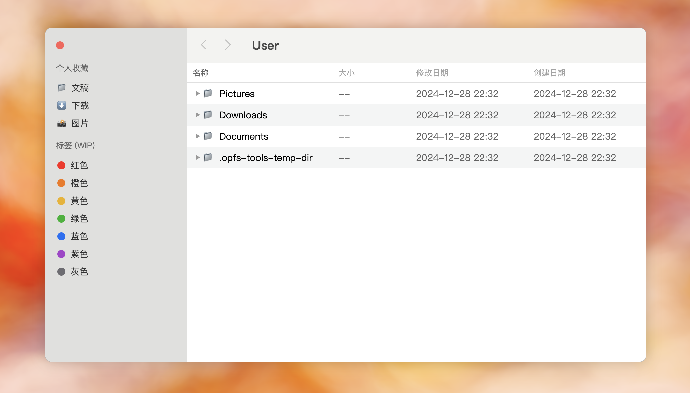

# opfs-finder

[中文](./README.md) | English

Try it now: <https://hughfenghen.github.io/opfs-finder>

## Author's Notes

While developing [WebAV][1] (a project for processing audio and video in browsers), handling large audio/video file submissions required a file system. Unlike conventional Web Apps, we couldn't load all data into memory.  
To facilitate WebAV's audio/video processing, I developed and open-sourced [opfs-tools][2] for convenient file operations.

[OPFS][4] is essentially a private storage space that browsers allocate to each website. Web developers can create, read, and write files in this private space using this API, requiring no user authorization and offering better performance.  
Currently, it has good compatibility support across various browsers. For more details, you can read [Introduction to Web File System (OPFS and Tools)][3].

I'm very excited that the Web can provide file APIs that are very close to operating system capabilities. I predict that OPFS API will have great potential for applications in the future.  
I planned to create a "product" that demonstrates OPFS capabilities to accelerate the adoption of this technology while improving the opfs-tools API.  
I happened to think of imitating the Finder (MacOS file management) APP that I use every day, which could achieve good results even without a visual designer;
As Web system Apps become increasingly complex and deeply dependent on the file system (OPFS), this project might even become a file manager for third-party applications.

Initially, I was hesitant to start this project since it mainly involves implementing "mundane" page interaction logic;
With the growing popularity of AI-assisted programming, I wanted to test its capabilities, and the results were quite impressive - **95% of this project's code was implemented by AI**;
Therefore, I've included all important prompts from the project's startup phase in the [Prompts document](./prompts.md), which can serve as a reference for AI-assisted programming beginners.  
For those interested in this project or AI-assisted programming, you can use the TODO List as practice exercises. We encourage using AI to implement features and submitting PRs after testing.

### Summary

- [OPFS][4] is a file system API in browsers, offering high performance without requiring user authorization
- [opfs-tools][2] is an open-source project based on OPFS, providing very convenient APIs for file operations
- This project (opfs-finder) mimics the Finder App, running in browsers
- Project motivations
  - To demonstrate OPFS capabilities and accelerate its adoption
  - To improve the opfs-tools API
  - To learn and apply AI technology in implementing common, mundane features, see [Prompts document](./prompts.md)
- Encouraging interested developers to use AI to implement TODO List items and submit PRs

## Running the Project

1. Clone the project locally
2. Run `pnpm i`
3. Run `pnpm dev`

## TODO List

### Styling

- [ ] Remove trailing zeros after decimal points in file sizes
- [ ] Hide files starting with .
- [ ] Set minimum window width to prevent file list line wrapping

### Features

- [ ] Add color labels for folders
- [ ] Cross-window file dragging (moving)
- [ ] Monitor folder changes, update list dynamically
- [ ] Mount system file directories
- [ ] Folder list sorting methods
- [ ] Publish to NPM for third-party use

## Appendix

- [WebAV][1]
- [opfs-tools][2]
- [Introduction to Web File System (OPFS and Tools)][3]
- [OPFS(Origin private file system)][4]

[1]: https://github.com/bilibili/WebAV
[2]: https://github.com/hughfenghen/opfs-tools
[3]: https://hughfenghen.github.io/posts/2024/03/14/web-storage-and-opfs/
[4]: https://developer.mozilla.org/zh-CN/docs/Web/API/File_System_API/Origin_private_file_system
